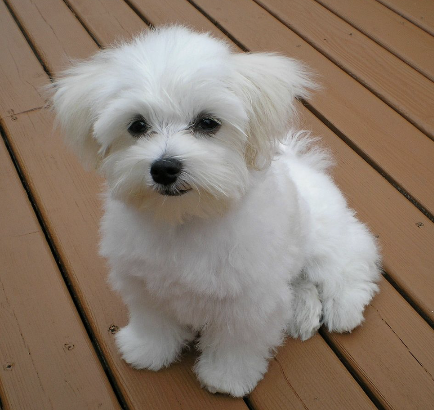
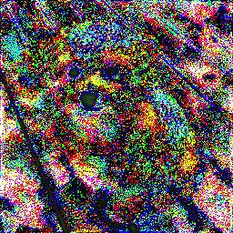
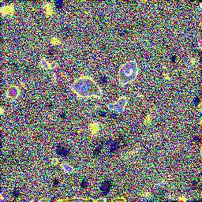
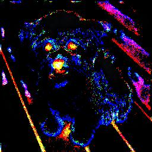
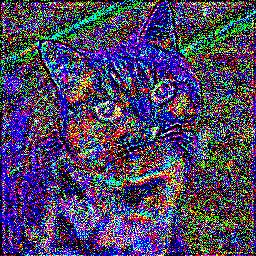
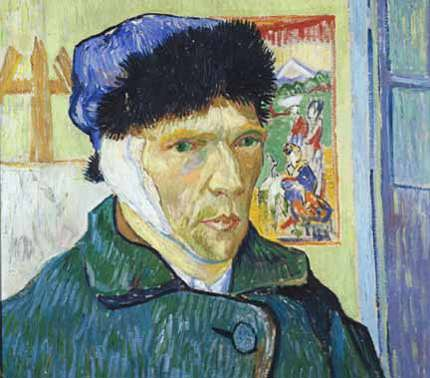

# chameleon-image

## Simple image reconstruction using mse
Given a source image, `chameleon-image` will "merge" into a target image. The result is stored as a `.gif` file.

The following is the result of taking a dog as a source image and cat as the target image.

<p align="center" >
  
  
  
</p>

## NeuralStyle
Given and content and style image, we can create an image that is the content image in the "style" of the style image.

For example, a cat and dog in the style of Vincent van Gogh.

<p align="center" >
  
  
  
</p>

<p align="center" >
  
  
  
</p>

<!-- <p align="center" >
  
  
  
</p>

<p align="center" >
  
  
   -->
<!-- </p> -->

## CNN for image reconstructuion
This is done by training a model on a neural network, in which the model takes in the source image as the input and outputs another image as the target. The model uses a layered convolution architecture in which each block consists of 2 convlutional layers, a batch norm, then finally a LeakyReLU. (I didn't really find much difference between ReLU and LeakyReLU so they can be used interchangeably).

```
self.model = nn.Sequential(
    nn.Conv2d(3, 64, 4, 2, 1, bias=False),
    nn.Conv2d(64, 128, 4, 2, 1, bias=False),
    nn.BatchNorm1d(64),
    nn.LeakyReLU(0.2, inplace=True),

    nn.Conv2d(128, 256, 4, 2, 1, bias=False),
    nn.Conv2d(256, 32, 4, 2, 1, bias=False),
    nn.BatchNorm1d(16),
    nn.LeakyReLU(0.2, inplace=True),

    nn.ConvTranspose2d(32, 256, 4, 2, 1, bias=False),
    nn.ConvTranspose2d(256, 128, 4, 2, 1, bias=False),
    nn.BatchNorm1d(64),
    nn.LeakyReLU(0.2, inplace=True),

    nn.ConvTranspose2d(128, 64, 4, 2, 1, bias=False),
    nn.BatchNorm1d(128),
    nn.LeakyReLU(0.2, inplace=True),

    nn.ConvTranspose2d(64, 3, 4, 2, 1, bias=False)
)
```

The model learns via a MSE loss function in which it is minimizing the "squared distance" between the ouput image from the model and target image. Eventually, the model will learn weights to fit the source image to the target image resulting in a sort of cool looking gif.

## Running the script - mseloss.py
If you wish to run the script with your own input images simply change the the first paramter in the following lines.

```
src = read_image('dog.jpeg', mode=torchvision.io.ImageReadMode.RGB).float()
...
tgt = read_image('cat.jpeg', mode=torchvision.io.ImageReadMode.RGB).float()
```

If you would like to change the output `.gif` filename, simply edit the following function.
```
make_gif(images, {filename})
```

Please note that the `read_image` function can only take in either a `.jpeg` or `.png` file type. In addition, the `Resize()` transormation will skew that image to a given size. As I chose a size of `(256, 256)` it is reccomended that you either have square images or change the size variable.

If you wish to scale to a higher/lower resolution image then you would need to also scale up/down the model architecture.